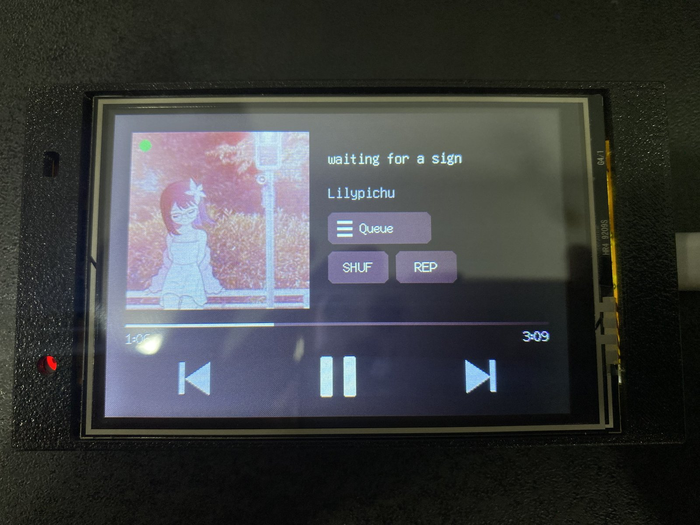

# CYD 3.5" Now-Playing Controller

A now-playing display and remote control for [pear-desktop](https://github.com/pear-devs/pear-desktop)'s `api-server` plugin, running on a 3.5" "Cheap Yellow Display" ESP32 board (**ESP32-3248S035R** — ST7796 SPI display + XPT2046 resistive touch, shared bus).



## Features

- Title / artist, album art, and playback position, updated in real time over the `api-server` websocket (no polling)
- Touch controls: previous / play-pause / next, tap the progress bar to seek, long-press the album art to like/unlike, vertical drag on the album art to change volume
- Full queue screen: tap the "Queue" tab to open it (auto-scrolled to the currently-playing track), paged with the arrows on the right edge, tap a track to jump to it, long-press a track to remove it from the queue
- Shuffle and repeat buttons below the "Queue" tab — green when active, repeat's label switches to "REP1" for repeat-one
- Momentary press-highlight: tapping a control (prev / play-pause / next / shuffle / repeat) flashes a ring on it so the tap registers instantly, instead of only "confirming" once the server state round-trips back
- Vietnamese, Japanese (Hiragana/Katakana/common Kanji), and other Unicode text support, with marquee scrolling for titles/artists that don't fit
- Background/accent color derived from the current track's album art, computed on the desktop side and sent over the websocket
- Album art is pre-scaled and re-encoded on the desktop before being pushed to the device — the ESP32 only decodes a small, already-sized JPEG, it never fetches or resizes the original thumbnail itself
- Album art is cached to SD by videoId, so replaying a song shows its art immediately instead of a placeholder flash while the fresh websocket frame is in flight — no SD card just disables this, everything else still works
- Small status dot, top-left corner of the art (green = SD mounted, gray = not), so it's visible at a glance whether the cache is active
- Red dot, bottom-left corner of the art, appears only when the websocket connection is down (WiFi drop, pear-desktop restart) — invisible the rest of the time
- Touch calibration is stored in NVS and only runs once, on first boot

## Hardware

- ESP32-3248S035R ("CYD" 3.5", resistive touch, ST7796 + XPT2046 on shared SPI)
- microSD card (optional, for the art cache) — on its own SPI bus (CS=GPIO5, SCK=18, MISO=19, MOSI=23), separate from the display's
- USB cable for flashing (COM port with an ESP32 in download mode)

## Requirements

- [pear-desktop](https://github.com/pear-devs/pear-desktop) running with the **api-server** plugin enabled (Options → Plugins → API Server), reachable from the ESP32 over Wi-Fi
- [PlatformIO](https://platformio.org/) (CLI or the VS Code extension)

## Setup

1. Copy the secrets template and fill in your Wi-Fi and api-server details:
   ```bash
   cp src/secrets.h.example src/secrets.h
   ```
   ```cpp
   #define WIFI_SSID "your-wifi-ssid"
   #define WIFI_PASS "your-wifi-password"
   #define API_HOST  "192.168.1.10"   // IP of the machine running pear-desktop
   #define API_PORT  26538
   #define API_BASE  "http://192.168.1.10:26538"
   ```
2. Build and flash:
   ```bash
   pio run -t upload --upload-port COM7
   ```
   If upload fails with "Wrong boot mode detected", hold the board's **BOOT** button, tap **RST**, keep BOOT held, then retry the upload — release BOOT once it starts connecting.
3. On first boot, touch the four calibration targets when prompted. This only happens once; the result is saved to flash.

## How it works

- `src/main.cpp` connects to `api-server`'s `/api/v1/ws` for live song/position/state updates, and posts to `/api/v1/previous`, `/api/v1/toggle-play`, `/api/v1/next`, `/api/v1/seek-to`, `/api/v1/like`, `/api/v1/volume`, `/api/v1/shuffle`, and `/api/v1/switch-repeat` for controls. Like state (not pushed over the websocket) is polled from `GET /api/v1/like-state` once per song. Repeated `/api/v1/like` calls toggle liked/unliked (see pear-desktop's `control.ts`), which is what makes the long-press act as a toggle. Shuffle/repeat state, unlike like state, *is* pushed over the websocket (`shuffle`/`repeat` fields on `PLAYER_INFO` and the `SHUFFLE_CHANGED`/`REPEAT_CHANGED` messages), so those two buttons need no polling at all.
- The queue screen fetches `GET /api/v1/queue/list` — a slim `{title, artist, videoId, selected}[]` — rather than `GET /api/v1/queue`, which is a raw pass-through of YouTube Music's internal queue object and for a real queue runs several hundred KB, too much for the ESP32 to fetch/parse reliably. Tapping a row calls `PATCH /api/v1/queue` with the chosen index; long-pressing a row calls `DELETE /api/v1/queue/{index}` and drops it locally without re-fetching.
- Japanese text picks `u8g2_font_unifont_t_japanese1` per-string when it contains Hiragana/Katakana/Kanji codepoints, falling back to the Vietnamese unifont subset otherwise (`pickFont()` in `main.cpp`) — the two scripts live in separate font ROMs to keep flash usage down.
- Album art and accent color aren't fetched by the device: pear-desktop's `api-server` plugin (see its `backend/routes/websocket.ts`) resizes the art to the device's exact display size, re-encodes it as a small JPEG, computes an average "signature color", and pushes both over the same websocket connection — as a binary frame for the art, and as an `accentColor` field alongside the normal JSON player-state messages.
- Each art frame received over the websocket is also written to `/art/<videoId>.jpg` on the SD card (first time only — the file isn't rewritten once it exists). On `VIDEO_CHANGED`, the device checks the cache before the fresh frame arrives, so a replayed song's art shows immediately instead of the placeholder.

## License

MIT
