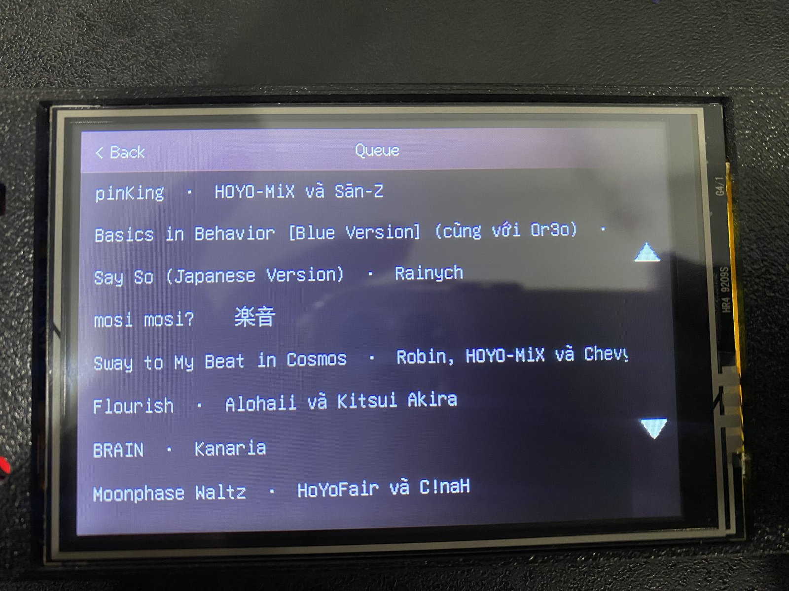

# CYD 3.5" Now-Playing Controller

A now-playing display and touch remote for [pear-desktop](https://github.com/pear-devs/pear-desktop)'s `api-server` plugin, running on a 3.5" **ESP32-3248S035R** "Cheap Yellow Display" (ST7796 SPI panel + XPT2046 resistive touch).

Album art, title, artist, and progress update live over a single WebSocket — the device never polls, and never fetches or resizes artwork itself.

<p align="center">
  
  
</p>

## Features

- **Live now-playing** — album art, title/artist (with marquee scroll when they overflow), and a delta-drawn progress bar, all pushed over the WebSocket in real time.
- **Accent theming** — background and accents are derived from each track's artwork on the desktop side and sent alongside the state, so the whole UI re-tints per song.
- **Full queue screen** — jump to any track, remove tracks, auto-scrolled to whatever is playing.
- **Unicode text** — Vietnamese, Japanese (Hiragana / Katakana / common Kanji), and other scripts, chosen per-string.
- **SD album-art cache** — replayed songs show their art instantly instead of a placeholder flash. Fully optional; no card just disables the cache.
- **At-a-glance status dots** — SD mounted (green), WebSocket disconnected (red).

## Touch controls

| Gesture | Where | Action |
|---|---|---|
| Tap | Prev / Play-Pause / Next | Transport controls (with a press-flash on the button) |
| Tap | Progress bar | Seek to that position |
| Tap | Shuffle / Repeat | Toggle shuffle · cycle repeat (off → all → one) |
| Long-press | Album art | Like / unlike the current track |
| Vertical drag | Album art | Adjust volume |
| Tap | "Queue" tab | Open the queue screen |
| Tap | Queue row | Jump to that track |
| Long-press | Queue row | Remove that track from the queue |

## Hardware

- **ESP32-3248S035R** ("CYD" 3.5" — ST7796 + XPT2046 on a shared SPI bus)
- **microSD card** *(optional, for the art cache)* — on its own SPI bus (`CS=GPIO5, SCK=18, MISO=19, MOSI=23`), separate from the display's
- USB cable for flashing (a COM port with the ESP32 in download mode)

## Setup

**Requirements:** [pear-desktop](https://github.com/pear-devs/pear-desktop) with the **api-server** plugin enabled (Options → Plugins → API Server) and reachable over Wi-Fi, plus [PlatformIO](https://platformio.org/) (CLI or VS Code extension).

1. Copy the secrets template and fill in your Wi-Fi and api-server details:
   ```bash
   cp src/secrets.h.example src/secrets.h
   ```
   ```cpp
   #define WIFI_SSID "your-wifi-ssid"
   #define WIFI_PASS "your-wifi-password"
   #define API_HOST  "192.168.1.10"   // IP of the machine running pear-desktop
   #define API_PORT  26538
   #define API_BASE  "http://192.168.1.10:26538"
   ```
2. Build and flash:
   ```bash
   pio run -t upload --upload-port COM7
   ```
   > If upload fails with *"Wrong boot mode detected"*, hold **BOOT**, tap **RST**, keep **BOOT** held, then retry — release once it starts connecting.
3. On first boot, touch the four calibration targets when prompted. This runs once; the result is saved to NVS.

## How it works

- **Live state & controls.** `src/main.cpp` connects to `/api/v1/ws` for song / position / state updates, and POSTs to `/previous`, `/toggle-play`, `/next`, `/seek-to`, `/like`, `/volume`, `/shuffle`, and `/switch-repeat`.
- **Like toggle.** Like state isn't pushed over the socket, so it's polled once per song from `GET /api/v1/like-state`. Repeated `/like` calls toggle liked/unliked (see pear-desktop's `control.ts`), which is what makes the long-press behave as a toggle. Shuffle/repeat *are* pushed (on `PLAYER_INFO` / `SHUFFLE_CHANGED` / `REPEAT_CHANGED`), so those buttons need no polling.
- **Queue.** The queue screen fetches `GET /api/v1/queue/list` — a slim `{title, artist, videoId, selected}[]` — instead of the raw `/queue`, which is a hundreds-of-KB pass-through of YouTube Music's internal object, too large for the ESP32 to parse. Tapping a row `PATCH`es the index; long-pressing `DELETE`s it and drops the row locally without re-fetching.
- **Artwork.** pear-desktop's `api-server` (`backend/routes/websocket.ts`) resizes the art to the device's exact 190×190 box, re-encodes a small JPEG, computes an average "signature color", and pushes both — a binary frame for the art plus an `accentColor` field on the JSON state. Each frame is also cached to `/art/<videoId>.jpg` on SD (written once), so `VIDEO_CHANGED` can show a replayed song's art before the fresh frame arrives.
- **Fonts.** `pickFont()` selects `u8g2_font_unifont_t_japanese1` per-string when it sees Hiragana/Katakana/Kanji codepoints, falling back to the Vietnamese unifont subset otherwise — the two scripts live in separate font ROMs to keep flash usage down.

## License

MIT
